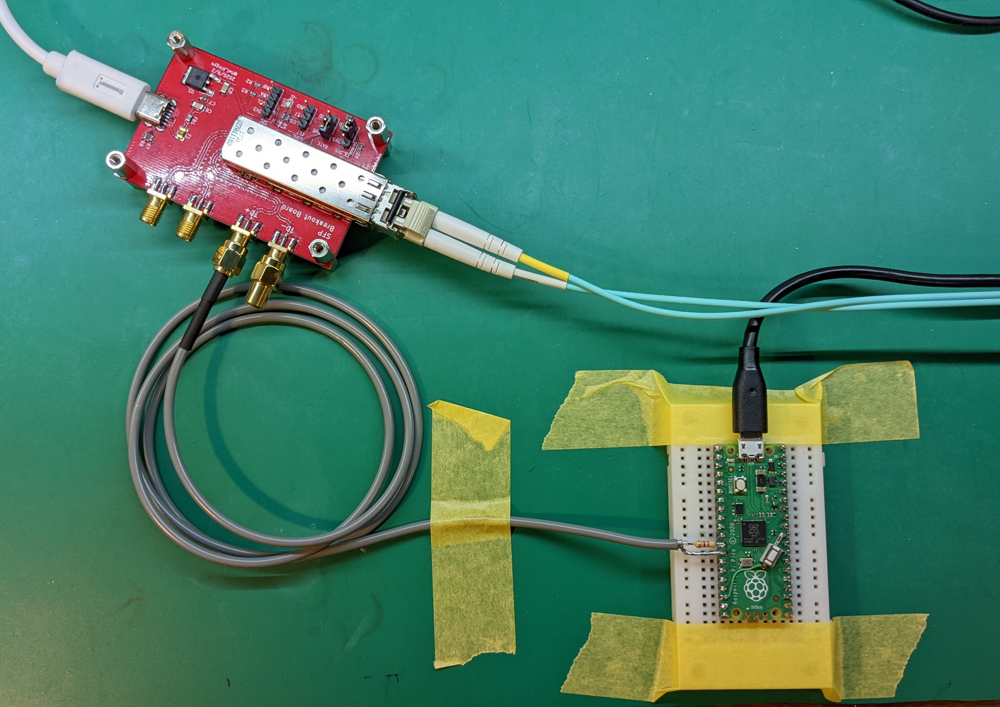

# Pico-100BASE-FX
RP2040で100BASE-FXの送信機を作るというやつ  
  
本リポジトリで実験した内容は、以下の RasPico SHIBAKI Board で置換可能です。  
今後は開発は、以下リポジトリで行います。  
https://github.com/kingyoPiyo/RasPico_SHIBAKI_Board

  

## How to build
```bash
mkdir build
cd build
cmake ..
make
```
